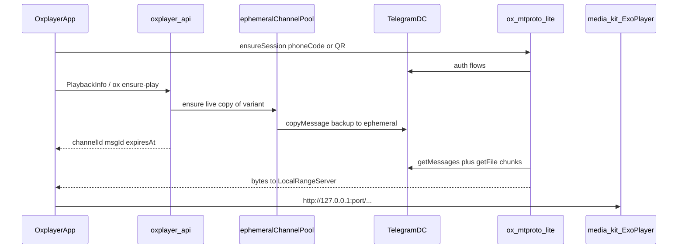

# MTProto Lite Direct Play (full)

## تصمیم جداسازی (قاطع)

**نه TDLib. نه «TDLib lite».** کتابخانهٔ هدف: `ox_mtproto_lite` — فقط auth + `getMessages` + `upload.getFile` + DC/CDN/file_reference.

**Auth (هر دو فرم‌فکتور):** نه فقط QR.

| دستگاه | جریان پیش‌فرض | جایگزین |
|---|---|---|
| موبایل / تبلت | شماره → کد SMS/تلگرام → در صورت نیاز رمز ۲FA | QR اختیاری |
| Android TV | QR (ریموت برای تایپ شماره بد است) | — |

لاگین OX/بات ([`oxplayer_telegram_login_panel`](oxplayer-client/lib/oxplayer/oxplayer_telegram_login_panel.dart)) جدا می‌ماند؛ این سشن **یوزر MTProto** برای دانلود فایل است.

**جای قرارگیری:** ماژول Gradle جدا داخل همان ریپوی کلاینت:

`oxplayer-client/android/ox_mtproto_lite/`

| جدا (ماژول)                         | چسباندن مستقیم تو `app/` / Dart |
| ----------------------------------- | ------------------------------- |
| پروفایل RAM روی TV بدون Flutter     | قاطی با Fladder fork            |
| مرز API تمیز برای تست واحد          | سخت برای ban/crypto regression  |
| بعداً استخراج به ریپوی sibling آسان | هزینهٔ جابجایی بعداً            |

**ریپوی git سوم برای v1 نه** — دو برنچ هم‌نام که خواستی (`client` + `be`) کافی است. اگر lib پایدار شد، بعداً به `oxplayer-wrapper/ox-mtproto-lite` منتقل می‌شود.

پل به Flutter: Pigeon یا MethodChannel نازک زیر [`lib/oxplayer/`](oxplayer-client/lib/oxplayer/) — منطق MTProto داخل Kotlin می‌ماند.

---

## برنچ‌ها (اولین کار اجرا)

هر دو ریپو از `main`:

```text
feat/mtproto-lite-direct-play
```

---

## معماری هدف



Truth = بکاپ/کلون خصوصی (مثل امروز در `media_copies`).  
پخش = کپی موقت عمومی با TTL. بن کانال = کانال جدید از pool؛ truth دست‌نخورده.

روی این برنچ: [`writePlaybackInfoOK`](oxplayer-be/apps/api/internal/server/jellyfin_routes.go) دیگر `MintPlaybackToken` / slug استریم برنمی‌گرداند. `MediaSource.Path` یا از طریق resolver OX به localhost می‌رسد.

---

## Backend (`oxplayer-be`)

### داده

مایگریشن جدید مثلاً:

- `ephemeral_channels` — pool کانال‌ها (`channel_id`, `username` یا invite، `status` active/banned، `created_at`)
- `ephemeral_play_copies` — (`media_variant_id`, `channel_id`, `message_id`, `expires_at`, `last_touch_at`, `status`)

ایندکس یکتا روی `(media_variant_id)` برای کپی زندهٔ فعال.

### سرویس ensure-play

منطق در `apps/api` (یا worker نازک کنار api):

1. اگر کپی زنده با `expires_at > now + skew` هست → `last_touch_at`/`expires_at` را تمدید کن (حداقل `now+5h`)، مختصات برگردان.
2. وگرنه از منبع truth (`media_copies` slot کلون/بکاپ) با [`tgcopy.CopyMessage`](oxplayer-be/packages/tgcopy) / الگوی [`provider-bot` CopyMessage](oxplayer-be/apps/provider-bot/internal/telegram/copy.go) به یک کانال `active` از pool فوروارد کن.
3. ردیف `ephemeral_play_copies` بنویس.
4. پاسخ به کلاینت: `{ channelId, messageId, username?, expiresAt }` (شکل پایدار JSON برای OX).

Feature flag محیطی مثلاً `PLAYBACK_TRANSPORT=mtproto_direct` تا روی برنچ پیش‌فرض این مسیر باشد.

### GC + ban

- GC دوره‌ای: پیام/کپی‌های `expires_at < now` را از کانال حذف + ردیف را `expired` کن.
- Ban watcher: خطای ارسال/خواندن کانال → `status=banned`، از pool خارج، کانال جدید بساز (یا ادمین seed کند)، ensure-play بعدی re-copy.
- Refcount نرم: هر ensure-play / heartbeat کلاینت `expires_at = max(expires_at, now+5h)`.

### PlaybackInfo

در [`jellyfin_routes.go` / `playback_progressive.go`](oxplayer-be/apps/api/internal/server/jellyfin_routes.go):

- به‌جای ساخت URL استریم، ensure-play را صدا بزن.
- `Path` را به یک URL قابل‌بازنویسی توسط کلاینت بده، مثلاً  
  `oxmtproto://{channelId}/{messageId}?exp=...`  
  یا فیلدهای OX کنار پاسخ + Path ساختگی که فقط resolver OX مصرف می‌کند.
- هوک کلاینت موجود: [`oxplayer_stream_url_resolver.dart`](oxplayer-client/lib/oxplayer/oxplayer_stream_url_resolver.dart) — قبل از پخش به `http://127.0.0.1:<port>/...` تبدیل می‌شود.

### ساب‌تایتل

بایت ویدئو فقط از تلگرام. VTT کوچک از **API** (استخراج/کش قبلی در DB یا آبجکت استوریج سبک) — نه سرویس استریم ویدئو. اگر در فاز اول آماده نبود: پخش بدون softsub تا endpoint VTT وصل شود.

### خارج از اسکوپ حذف فیزیکی ox-stream در روز اول

کد/دیپلوی ox-stream روی این برنچ از مسیر پخش جدا می‌شود (دیگر URL ساخته نمی‌شود). پاکسازی کامل سرویس/کامپوز می‌تواند entهای بعدی همان برنچ باشد تا ریسک merge کم بماند — ولی **fallback پخش از طریق آن وجود ندارد**.

---

## Client (`oxplayer-client`)

### ماژول `android/ox_mtproto_lite`

Kotlin library، وابستگی در [`android/settings.gradle`](oxplayer-client/android/settings.gradle):

مسئولیت‌ها:

- **Phone auth:** `auth.sendCode` → `auth.signIn` → در صورت نیاز `auth.checkPassword` (۲FA)
- **QR auth:** login-token flow برای TV (و اختیاری روی موبایل/تبلت)
- ذخیرهٔ session روی دیسک (بدون SQLite چت)
- بدون updates سنگین / بدون کش دیالوگ
- `getFile` با stripe هم‌تراز تلگرام + ring buffer ۲–۸MB
- `LocalRangeServer` روی localhost (Range برای seek)
- بودجهٔ RAM هدف: اندازه‌گیری روی TV ضعیف قبل از merge گسترده

تست جدا: یک `androidTest` یا sample activity داخل ماژول برای پروفایل RSS بدون UI Fladder.

### لایهٔ OX Flutter (`lib/oxplayer/`)

- UI جدا از [`oxplayer_telegram_login_panel.dart`](oxplayer-client/lib/oxplayer/oxplayer_telegram_login_panel.dart) (آن لاگین OX/بات است، نه سشن یوزر تلگرام)
- **سشن پخش تلگرام:**
  - موبایل/تبلت: فرم شماره + کد + فیلد ۲FA در صورت نیاز؛ لینک/دکمهٔ «ورود با QR» اختیاری
  - TV: صفحهٔ QR تمام‌صفحه (AdaptiveLayout / form factor موجود)
- Bridge: startProxy(coords) → localhost URL
- Resolver پخش: `oxmtproto://` → proxy
- Env: `TELEGRAM_API_ID` / `TELEGRAM_API_HASH` فقط برای کلاینت یوزر (از `OxplayerEnv`)
- بدون ویرایش عمیق Fladder؛ فقط thin hook در مسیر پخش OX موجود

### پلتفرم فاز ۱

Android phone + tablet + Android TV. iOS/دسکتاپ بعد از سبز شدن RAM و E2E.

---

## ترتیب پیاده‌سازی

1. ساخت برنچ `feat/mtproto-lite-direct-play` روی هر دو ریپو
2. اسکلت `ox_mtproto_lite` + phone/code(+2FA) + QR + getFile (spike داخل ماژول)
3. LocalRangeServer + پخش از localhost روی phone و یک TV
4. مایگریشن + pool + ensure-play + GC در be
5. اتصال PlaybackInfo / resolver کلاینت به ensure-play
6. Ban recovery + تمدید TTL با heartbeat
7. ساب‌تایتل API در صورت آماده بودن داده
8. تست E2E: یک عنوان کاتالوگ → فوروارد → پخش → حذف بعد TTL (حداقل یک دستگاه touch + یک TV)

---

## معیار موفقیت تست برنچ

- پخش فیلم واقعی کاتالوگ روی phone/tablet و Android TV بدون URL استریم سرور
- ورود سشن TG: شماره+کد روی موبایل؛ QR روی TV
- RSS اضافه‌شدهٔ `ox_mtproto_lite` زیر بودجهٔ توافقی روی TV هدف (عدد در PR)
- بعد از TTL پیام از کانال ephemeral رفته؛ truth در بکاپ سالم
- بن شبیه‌سازی‌شدهٔ یک کانال pool → ensure بعدی کانال دیگر و پخش ادامه
