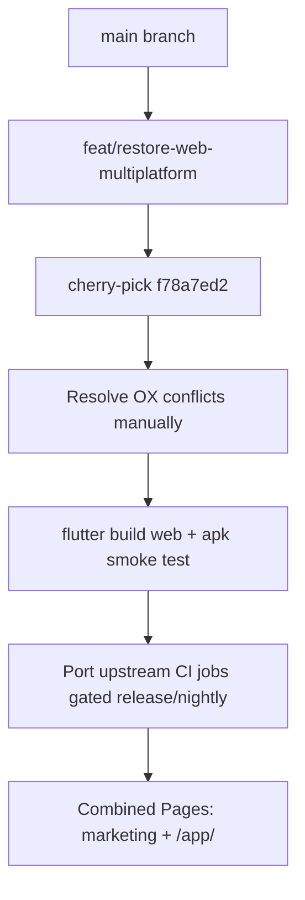
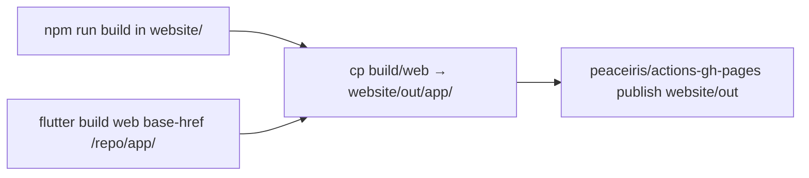

# بازگردانی Web و CI چندپلتفرمی

## وضعیت فعلی

- روی [`main`](c:\Users\Aryan\Documents\Projects\oxplayer-wrapper\oxplayer-client): `flutter build web` با خطای _"not configured for the web"_ شکست می‌خورد چون [`web/index.html`](c:\Users\Aryan\Documents\Projects\oxplayer-wrapper\oxplayer-client\web\index.html)، `manifest.json` و `drift_worker.dart.js` در کامیت [`d4d8110a`](c:\Users\Aryan\Documents\Projects\oxplayer-wrapper\oxplayer-client) حذف شده‌اند.
- شاخه [`restore/fladder-web`](c:\Users\Aryan\Documents\Projects\oxplayer-wrapper\oxplayer-client) (`f78a7ed2`) همان حذف را revert می‌کند ولی **۲۱ کامیت بعدی** `main` (Sentry، TV login، `app.oxplayer`، CI OX) را ندارد.
- CI فعلی ([`.github/workflows/build.yml`](c:\Users\Aryan\Documents\Projects\oxplayer-wrapper\oxplayer-client.github\workflows\build.yml)) فقط Android است.
- سایت مارکتینگ Next.js جداگانه در [`pages.yml`](c:\Users\Aryan\Documents\Projects\oxplayer-wrapper\oxplayer-client.github\workflows\pages.yml) روی root Pages دیپلوی می‌شود.

## استراتژی کلی



**برنچ جدید:** `feat/restore-web-multiplatform` از `main`

**منبع بازیابی:** اول [`f78a7ed2`](c:\Users\Aryan\Documents\Projects\oxplayer-wrapper\oxplayer-client) (bulk revert)، سپس برای فایل‌های conflict از [`refs/Fladder`](c:\Users\Aryan\Documents\Projects\oxplayer-wrapper\refs\Fladder) به‌عنوان مرجع upstream.

---

## فاز ۱ — بازیابی کد Web

### ۱.۱ فایل‌های حذف‌شده (restore کامل از upstream)

| فایل                                                                                                                                                         | نقش                                |
| ------------------------------------------------------------------------------------------------------------------------------------------------------------ | ---------------------------------- |
| [`web/index.html`](c:\Users\Aryan\Documents\Projects\oxplayer-wrapper\refs\Fladder\web\index.html)                                                           | shell Flutter web                  |
| [`web/manifest.json`](c:\Users\Aryan\Documents\Projects\oxplayer-wrapper\refs\Fladder\web\manifest.json)                                                     | PWA                                |
| [`web/drift_worker.dart.js`](c:\Users\Aryan\Documents\Projects\oxplayer-wrapper\refs\Fladder\web\drift_worker.dart.js)                                       | Drift worker                       |
| [`lib/bootstrap/platform/web_app_wrapper.dart`](c:\Users\Aryan\Documents\Projects\oxplayer-wrapper\refs\Fladder\lib\bootstrap\platform\web_app_wrapper.dart) | bootstrap وب                       |
| [`lib/profiles/web_profile.dart`](c:\Users\Aryan\Documents\Projects\oxplayer-wrapper\refs\Fladder\lib\profiles\web_profile.dart)                             | Jellyfin device profile مرورگر     |
| [`lib/stubs/web/*.dart`](c:\Users\Aryan\Documents\Projects\oxplayer-wrapper\refs\Fladder\lib\stubs\web)                                                      | stubهای `smtc_windows` / `lib_mdk` |
| `lib/util/seerr_http_client_web.dart`, `lib/widgets/full_screen_helpers/full_screen_helper_web.dart`, `lib/screens/book_viewer/book_viewer_reader_web.dart`  | رفتار مخصوص وب                     |

`web/favicon.png`, `web/icons/`, `web/sqlite3.wasm` از قبل روی دیسک هستند — نگه داشته می‌شوند.

### ۱.۲ شاخه‌های `kIsWeb` در ~۵۶ فایل Fladder

با `git cherry-pick f78a7ed2` برمی‌گردند. فایل‌هایی که روی `main` بعد از purge تغییر کرده‌اند و **حتماً** merge دستی می‌خواهند:

| فایل                                                                                                                                                                      | نگه‌داشتن از `main`                                                     | اضافه از restore/upstream                                                     |
| ------------------------------------------------------------------------------------------------------------------------------------------------------------------------- | ----------------------------------------------------------------------- | ----------------------------------------------------------------------------- |
| [`lib/main.dart`](c:\Users\Aryan\Documents\Projects\oxplayer-wrapper\oxplayer-client\lib\main.dart)                                                                       | `OxplayerSentry.init()`                                                 | `if (!kIsWeb)` قبل از Sentry (یا تست `sentry_flutter` روی web)                |
| [`lib/bootstrap/app_bootstrap.dart`](c:\Users\Aryan\Documents\Projects\oxplayer-wrapper\oxplayer-client\lib\bootstrap\app_bootstrap.dart)                                 | `OxplayerBrand`                                                         | `kIsWeb` → load `config/config.json`؛ skip `getApplicationDocumentsDirectory` |
| [`lib/bootstrap/platform/platform_app_wrapper.dart`](c:\Users\Aryan\Documents\Projects\oxplayer-wrapper\oxplayer-client\lib\bootstrap\platform\platform_app_wrapper.dart) | —                                                                       | `if (kIsWeb) WebAppWrapper`                                                   |
| [`lib/wrappers/players/lib_mpv.dart`](c:\Users\Aryan\Documents\Projects\oxplayer-wrapper\oxplayer-client\lib\wrappers\players\lib_mpv.dart)                               | منطق **ox-stream remux** فعلی                                           | `kIsWeb` remux + `libass: !kIsWeb && ...` از `f78a7ed2`                       |
| [`lib/oxplayer/oxplayer_telegram_login_panel.dart`](c:\Users\Aryan\Documents\Projects\oxplayer-wrapper\oxplayer-client\lib\oxplayer\oxplayer_telegram_login_panel.dart)   | UX TV (`!isTv`)                                                         | `showDeviceButton = !isTv && !kIsWeb` (وب = QR-only مثل TV)                   |
| [`lib/oxplayer/oxplayer_provider_read.dart`](c:\Users\Aryan\Documents\Projects\oxplayer-wrapper\oxplayer-client\lib\oxplayer\oxplayer_provider_read.dart)                 | suffix Android TV                                                       | suffix `" Web"` وقتی `kIsWeb`                                                 |
| [`pubspec.yaml`](c:\Users\Aryan\Documents\Projects\oxplayer-wrapper\oxplayer-client\pubspec.yaml)                                                                         | overrides `media_kit` از media-kit/main، `fvp ^0.35.2`، Sentry، version | `universal_html: ^2.2.4` و `web: ^1.1.0`                                      |

**مهم برای Android:** overrideهای `media_kit` در [`pubspec.yaml`](c:\Users\Aryan\Documents\Projects\oxplayer-wrapper\oxplayer-client\pubspec.yaml) (کامنت خط ۱۵۰: fix زیرنویس وب) **دست نخورده** بمانند — این همان چیزی است که Android را سالم نگه می‌دارد.

### ۱.۳ برندینگ وب

از upstream کپی + سفارشی‌سازی OX:

- `web/index.html`: title/description → OXPlayer
- `web/manifest.json`: name/short_name/theme OX

---

## فاز ۲ — حفاظت از Android

قبل از merge، این موارد **بدون تغییر رفتار** بمانند:

- flavor `production`، signing، ABI parity، Sentry upload در [`build.yml`](c:\Users\Aryan\Documents\Projects\oxplayer-wrapper\oxplayer-client.github\workflows\build.yml)
- [`oxplayer-flutter-env`](c:\Users\Aryan\Documents\Projects\oxplayer-wrapper\oxplayer-client.github\actions\oxplayer-flutter-env\action.yml) روی job اندروید
- `packageName: app.oxplayer` در Play upload
- Telegram release notify

**تست smoke محلی (قبل از PR):**

```bash
flutter pub get
flutter build apk --release --flavor production --dart-define-from-file=...
flutter build web --release --dart-define-from-file=...
```

---

## فاز ۳ — CI/CD از upstream (با محدودیت‌های انتخاب‌شده)

منبع: [`refs/Fladder/.github/workflows/build.yml`](c:\Users\Aryan\Documents\Projects\oxplayer-wrapper\refs\Fladder.github\workflows\build.yml)

### ۳.۱ jobهای جدید — فقط `release` / `nightly` / tag

| Job                   | Runner             | شرط                           |
| --------------------- | ------------------ | ----------------------------- |
| `build-web`           | ubuntu             | `build_type != 'development'` |
| `build-windows`       | windows-2022       | همان                          |
| `build-ios`           | macos-latest       | همان                          |
| `build-macos`         | macos-latest       | همان                          |
| `build-linux`         | ubuntu             | همان                          |
| `build-linux-flatpak` | ubuntu (container) | همان + فقط release/nightly    |

**PR / development:** فقط `build-android` (همان رفتار فعلی).

هر job غیراندرویدی:

- `uses: ./.github/actions/oxplayer-flutter-env`
- `flutter build ... --dart-define-from-file="$FLUTTER_BUILD_ENV_FILE"`
- نام artifact: `oxplayer-{platform}`

### ۳.۲ `build-web` — base-href برای زیرمسیر

```bash
flutter build web --release \
  --base-href /${{ github.event.repository.name }}/app/ \
  --dart-define-from-file="$FLUTTER_BUILD_ENV_FILE"
```

خروجی: `oxplayer-web` artifact

### ۳.۳ `create_release` — گسترش

- `needs`: همه jobهای بیلد (با `if` مناسب برای flatpak)
- دانلود artifactها و rename به الگوی `OXPlayer-{Platform}-{version}.*` (مثل Android فعلی)
- فایل‌های release: APK/AAB + Windows portable/installer + iOS IPA + macOS DMG + Linux tarball/AppImage + Flatpak + web zip (اختیاری)

### ۳.۴ `release_web` — Docker (از upstream)

از [`Dockerfile`](c:\Users\Aryan\Documents\Projects\oxplayer-wrapper\oxplayer-client\Dockerfile) / [`Dockerfile-rootless`](c:\Users\Aryan\Documents\Projects\oxplayer-wrapper\oxplayer-client\Dockerfile-rootless) + [`docker-entrypoint.sh`](c:\Users\Aryan\Documents\Projects\oxplayer-wrapper\oxplayer-client\docker-entrypoint.sh):

- push به `ghcr.io` با image name `oxplayer` / `oxplayer-rootless`
- env `FLADDER_WEBPATH` → `OXPLAYER_WEBPATH` (یا هر دو برای سازگاری)
- فقط روی `build_type == 'release'`

### ۳.۵ GitHub Pages — مارکتینگ + Flutter در `/app/`

**تداخل:** `pages.yml` الان root را با Next.js پر می‌کند؛ upstream کل root را با Flutter پر می‌کند.

**راه‌حل انتخاب‌شده:** job جدید `release_web_pages` (فقط release):



- [`pages.yml`](c:\Users\Aryan\Documents\Projects\oxplayer-wrapper\oxplayer-client.github\workflows\pages.yml) برای push معمولی `main` (فقط مارکتینگ) **بدون تغییر** بماند.
- روی release، `release_web_pages` سایت کامل (مارکتینگ + `/app/`) را دیپلوی می‌کند.
- لینک نهایی اپ: `https://gurbeh.github.io/oxplayer-client/app/`

### ۳.۶ پاکسازی legacy

- [`.vscode/tasks.json`](c:\Users\Aryan\Documents\Projects\oxplayer-wrapper\oxplayer-client.vscode\tasks.json): task «Build Web and Docker» را به env OX و base-href درست به‌روز کنید.

---

## فاز ۴ — ریسک‌ها و محدودیت‌های شناخته‌شده

| ریسک                                    | mitigation                                                                            |
| --------------------------------------- | ------------------------------------------------------------------------------------- |
| `fvp`/ffi روی web                       | override `media_kit` از media-kit/main نگه داشته شود؛ smoke `flutter build web` در CI |
| Sentry روی web                          | guard `!kIsWeb` یا تست واقعی؛ DSN اختیاری است                                         |
| Flatpak هنوز `nl.jknaapen.fladder` دارد | خارج از scope این PR؛ job بیلد می‌دهد ولی rebranding جدا                              |
| `/app/` تا اولین release خالی است       | قابل قبول؛ یا لینک از مارکتینگ فقط بعد از release                                     |
| Windows CI flaky (media_kit extract)    | همان ریسک upstream؛ job gated release/nightly                                         |

---

## ترتیب اجرا

1. `git checkout -b feat/restore-web-multiplatform main`
2. `git cherry-pick f78a7ed2` → resolve conflicts (~۱۰–۱۵ فایل)
3. merge دستی OX hooks (جدول فاز ۱.۲)
4. برندینگ `web/index.html` + `manifest.json`
5. `flutter pub get` + smoke build (apk + web)
6. بازنویسی [`build.yml`](c:\Users\Aryan\Documents\Projects\oxplayer-wrapper\oxplayer-client.github\workflows\build.yml): jobهای upstream + OX Android/Sentry/notify
7. اضافه کردن `release_web` + `release_web_pages`
8. به‌روزرسانی `.vscode/tasks.json`
